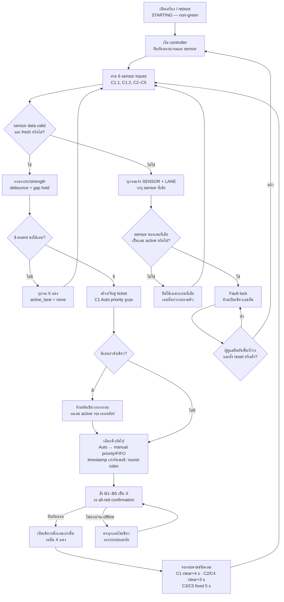
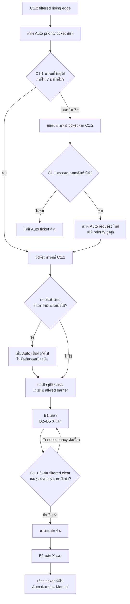
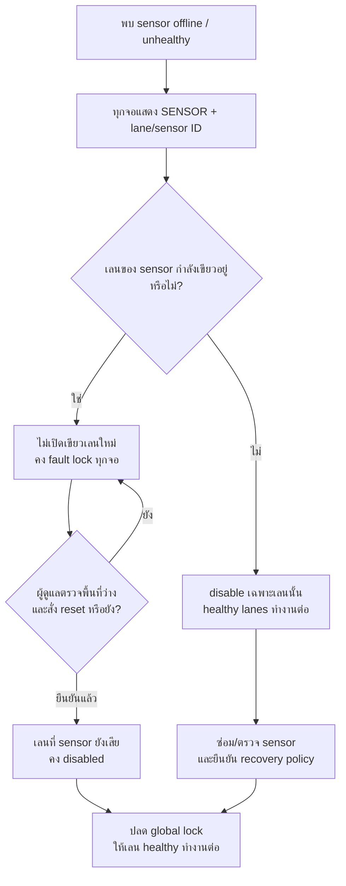

# T3 Traffic Control — Logic & Flow

**สถานะเอกสาร:** รวบรวมกติกาที่เจ้าของระบบยืนยันแล้ว เพื่อใช้คุยกับทีมและเป็นฐานก่อนพัฒนา  
**สถานะโค้ด:** ยังไม่ได้พัฒนาลอจิก T3 ในเอกสารนี้ และยังไม่ได้ยืนยันกับรถจริง  
**ขอบเขต:** การตรวจจับ, การสร้าง/เลือกคิว, เวลาไฟเขียว, interlock ไฟเขียว, sensor fault, และสถานะที่จอต้องแสดง

> ใช้กติกาที่ผู้ใช้ยืนยันในบทสนทนาเป็นข้อกำหนด T3 ส่วนค่าจากโค้ด/Config ด้านล่างเป็นพฤติกรรม V1 ปัจจุบัน ไม่ได้แปลว่าค่านั้นถูกยืนยันเป็นค่าติดตั้ง T3 แล้ว ค่า V1 ที่ยังไม่ยืนยันต้องแยกเป็น config และจูนจากข้อมูลหน้างานก่อนใช้งานจริง

## 1. ภาพรวมระบบ T3

- มีเลนเข้าพื้นที่แยกร่วมกัน 5 เลน: C1–C5
- มีจอประจำเลน B1–B5 ตามตารางด้านล่าง
- อนุญาตให้มีไฟเขียวได้ไม่เกิน **หนึ่งเลนในเวลาเดียวกัน**
- เมื่อไม่มีคำขอและไม่มี fault ให้ทุกจอแสดง **กากบาทแดง**
- ตอนเปิดเครื่องหรือ reboot ต้องแสดงสถานะ **STARTING/REBOOT ที่ไม่ใช่เขียว** ก่อนเริ่มควบคุมการจราจร
- แยกมี Controller กลางกล่อง A ข้าง pillar เป็นผู้ตัดสินคิวและเป็นแหล่งอำนาจเดียวในการอนุญาตเขียว

## 2. ผังเลนและเซนเซอร์

| ลำดับคิว | เลน | ประเภท | Sensor | หน้าที่ Sensor | จอ |
|---:|---|---|---|---|---|
| 1 | C1 | Auto E-Car | C1.1 | ใกล้แยก ตรวจว่าชุดรถผ่านและยืนยัน filtered clear เพื่อเริ่มเวลาปล่อยเลน | B1 |
|  |  |  | C1.2 | ไกลแยก สร้างคำขอ Auto priority ล่วงหน้า |  |
| 2 | C2 | Manual ปกติ | C2 | ตรวจรถที่จุดรอคิวก่อนแยก | B2 |
| 3 | C3 | Manual พิเศษ | C3 | เซนเซอร์ส่องลงพื้นข้างเลน ใช้มือแจ้งว่าพร้อม ไม่มีเซนเซอร์ตรวจรถพ้นแยก | B3 |
| 4 | C4 | Manual ปกติ | C4 | ตรวจรถที่จุดรอคิวก่อนแยก | B4 |
| 5 | C5 | Manual พิเศษ | C5 | เซนเซอร์ส่องลงพื้นข้างเลน ใช้มือแจ้งว่าพร้อม ไม่มีเซนเซอร์ตรวจรถพ้นแยก | B5 |

V1 ปัจจุบันสร้าง state ให้เซนเซอร์ชื่อ S1–S4 เท่านั้น จึงยังไม่มีการแมป C1.1/C1.2/C2–C5 หรือ B1–B5 แบบ T3

## 3. กติกาคิว

### 3.1 ลำดับการเลือกเลน

1. C1 Auto มี priority สูงสุดแบบตายตัว เมื่อมี Auto ticket ที่พร้อมรับบริการ ให้มาก่อน Manual ที่รออยู่
2. คำขอ Auto ที่ C1.2 ตรวจพบถูกใส่คิวทันที แต่ **ห้ามตัดไฟเขียวของเลนที่กำลังให้รถผ่าน**; Auto เป็นคิวถัดไปเมื่อเลน active จบรอบและระบบปลอดภัยพอเปลี่ยนเลน
3. C2–C5 ใช้ priority ที่ปรับได้ใน config/UI แล้วเรียง FIFO ภายใน priority เดียวกัน
4. ใช้ round-robin เฉพาะเมื่อ priority และ timestamp เสมอกันพอดี เพื่อเลือกผู้ชนะของรายการที่เสมอกันเท่านั้น
5. Auto หลายคำขอต่อกันจะได้บริการก่อน Manual ตาม strict priority; Manual อาจต้องรอจน Auto ที่รออยู่หมด
6. รถ Manual ที่ตรวจพบแล้วไม่ยกเลิกคิวเพราะรถถอยหรือเซนเซอร์ clear; C3/C5 ticket จะค้างในคิวหลังยกมือแล้วจนถึงรอบของเลน
7. ถ้า C2/C4 มีรถถัดไปในเลนเดิม และไม่มีคิวเลนอื่นที่ได้เลือกก่อน ให้คงไฟเขียวเลนเดิมต่อได้ หากมีคิวอื่น ให้เลือกตาม priority/FIFO; ถ้าผลเลือกยังเป็นเลนเดิมก็ไม่ต้องดับเขียวคั่น

### 3.2 Auto: C1.2 จับคู่ C1.1

- filtered rising edge ของ C1.2 สร้าง Auto ticket ที่มี priority สูงสุด
- ticket จาก C1.2 ต้องถูกจับคู่กับการตรวจพบที่ C1.1 ภายใน **7 วินาที**
- ถ้า 7 วินาทีแล้ว C1.1 ยังไม่พบ ให้หมดอายุและทิ้งเฉพาะ ticket แทรกคิวจาก C1.2
- ถ้ารถมาถึง C1.1 ภายหลัง ให้ C1.1 สร้างคำขอ Auto ใหม่ตามปกติ โดยยังได้ priority ของ Auto
- เมื่อ C1 ticket ถึงหัวคิว รถต้องมาถึง C1.1 ก่อนจึงเริ่มเขียวที่ B1
- Auto ที่มาถึงระหว่างเลนอื่นกำลังเขียวถูกบันทึกคิวทันที แต่เลนปัจจุบันต้องทำช่วงบริการให้เสร็จก่อน

### 3.3 Manual ปกติ: C2 และ C4

- การตรวจพบรถที่ C2/C4 สร้าง ticket ตามเวลาและ priority ที่ตั้งไว้
- เมื่อถึงรอบ จอของเลนนั้นเขียวขณะชุดรถ+dolly ผ่านจุดตรวจจับ
- เริ่มนับเวลาปล่อยเมื่อ sensor ส่งสถานะ **filtered clear** แล้ว จากนั้นคงเขียวต่อ **3 วินาที** และจึงจบการบริการ
- รถคันถัดไปของเลนเดิมอาจต่อรอบโดยไม่ดับเขียว หากการเลือกคิวยืนยันว่าเลนเดิมได้รอบถัดไป

### 3.4 Manual พิเศษ: C3 และ C5

- คนขับ/ผู้ปฏิบัติงานกวาดมือเพื่อหาเซนเซอร์ได้; เมื่อระบบตรวจพบมือ ให้ B3/B5 แสดง feedback ที่เห็นชัดว่าตรวจพบแล้ว
- เริ่มนับเมื่อสัญญาณผ่านการกรองเป็น active; ต้องค้างการตรวจพบครบ **3 วินาที** จึงสร้างหนึ่ง ticket
- dropout สั้น ๆ ระหว่างยื่นมือให้อนุโลมได้ตามค่า `hand_clear_grace_ms` ที่ตั้งใน config; ค่านี้ยังต้องจูนหน้างาน ไม่กำหนดตัวเลขขึ้นเองในเอกสาร
- หนึ่งการค้างที่ครบเวลาได้หนึ่ง ticket เท่านั้น; หลังสร้าง ticket ต้องตรวจพบการ clear ก่อนจึง re-arm เพื่อสร้าง ticket ใหม่
- ticket ที่สร้างแล้วค้างในคิว แม้ผู้ปฏิบัติงานยกมือออก
- เมื่อถึงคิว จอเขียวคงที่ **5 วินาที** ตามค่าที่ปรับได้ใน config จากนั้นจบการบริการ
- C3/C5 ไม่มี sensor ตรวจว่ารถออกจากแยกแล้วหรือไม่; 5 วินาทีเป็นเวลาบริการแบบกำหนดตายตัวที่ต้องจูนจากหน้างาน

## 4. การกรอง Sensor และความหมายของเวลา

### 4.1 ค่าที่ตรวจพบใน V1 ปัจจุบัน

| รายการ | ค่า V1 ปัจจุบัน | ความหมาย |
|---|---:|---|
| `loop_hz` | 20 Hz | เป้าหมายรอบ Controller ทุก 50 ms ไม่ใช่อัตราการยิงเฟรมของ TF-Mini Plus และไม่รับประกันว่า loop จะจบทุก 50 ms |
| UART baud | 115200 | ความเร็ว serial ที่ host ใช้อ่าน sensor |
| Serial read timeout | 50 ms | `TFMiniReader` รอได้ถึง 50 ms เมื่อไม่มี byte รออ่าน; SensorManager อ่านพอร์ตเรียงกันทีละตัว จึงอาจทำให้รอบจริงช้ากว่า 50 ms; ถ้า T3 มี 6 พอร์ตและทุกพอร์ตต้องรอ timeout เต็ม รอบนั้นอาจเสียเวลารอ serial รวมได้ถึงประมาณ 300 ms ก่อน logic ส่วนที่เหลือ (ขอบเขตทฤษฎี ต้องวัดจริง) |
| รูปแบบเฟรมที่ host รับ | 9 bytes | V1 ค้น header `0x59 0x59` และตรวจ checksum ก่อนใช้ระยะ/strength; ไม่ได้ตั้งอัตราเฟรมของ sensor จากโค้ดส่วนนี้ |
| เงื่อนไข raw detect | ระยะ 30–250 cm และ strength ≥100 | ค่าจาก `settings.example.json`; ต้องปรับตามตำแหน่งและผิวรถจริง |
| `debounce_ms` | 200 ms | raw detection ต้องต่อเนื่องอย่างน้อย 200 ms ก่อนเปลี่ยนเป็น `occupied` |
| `gap_hold_s` | 1.2 s | หลังไม่มีเฟรมตรวจพบ ระบบยังคง `occupied` ต่ออีกกว่า 1.2 s ก่อนประกาศ filtered clear; นี่คือ clear/gap filter ไม่ใช่การอ่านเฟรมทุก 1.2 s |
| `offline_timeout_s` | 2.0 s | ไม่มี valid frame นานเกิน 2 s แล้ว SensorState ถูกทำเครื่องหมาย offline |
| `recover_stable_s` | 1.0 s | V1 ต้องเห็นเฟรม valid ต่อเนื่องตามช่วง recovery นี้ก่อนเปลี่ยนสถานะกลับ online |
| `reopen_interval_s` | 2.0 s | V1 เว้นช่วงก่อนลองเปิด serial reader ใหม่หลังเปิดพอร์ต/อ่านพอร์ตล้มเหลว |
| Sensor log interval | 1.0 s | ระยะเวลาพิมพ์ตัวอย่าง sensor ลง log ไม่ใช่อัตรา sample ที่นำไปควบคุม |

โค้ด host อ่าน TF-Mini frames 9-byte ที่มีอยู่ใน serial buffer; ไม่พบคำสั่งใน V1 ที่ตั้งอัตราเฟรมภายในตัว TF-Mini Plus ดังนั้น **ยังยืนยันอัตราอ่านจริงของหัว sensor จากโค้ดนี้ไม่ได้** ต้องตรวจค่าจากตัว sensor/วัด raw trace หน้างาน ค่าตั้ง 20 Hz ของ Pi ไม่ได้ทำให้ sensor ส่งเฟรมที่ 20 Hz โดยอัตโนมัติ

### 4.2 เมื่อเริ่มนับ 3/4 วินาที

`filtered clear` เกิดหลัง sensor ไม่รายงาน detection ต่อเนื่องครบ `gap_hold_s` แล้วเท่านั้น เวลาปล่อยเลน T3 เริ่มหลัง event นี้:

```text
เฟรมสุดท้ายที่ยัง detect
  → gap_hold_s (ค่า V1 อ้างอิง 1.2 s; ต้อง config/tune สำหรับ T3)
  → filtered clear event
  → เริ่มนับเวลา T3: C1 = 4 s, C2/C4 = 3 s
  → จบเขียวของเลนนั้น และกลับไปเลือกคิวถัดไป
```

ดังนั้นถ้าใช้ `gap_hold_s=1.2 s` ตาม V1 เวลาจากเฟรม detect สุดท้ายถึงการเริ่มนับ 4/3 วินาทีจะมีช่วงกรอง clear เพิ่มประมาณ 1.2 วินาทีก่อนหน้า ไม่ใช่บวก `gap_hold` ซ้ำหลังครบเวลา 4/3 วินาที และห้ามส่ง sensor ที่ offline/stale มาเป็นหลักฐานว่า clear

### 4.3 ช่องว่าง Auto ประมาณ 0.5 เมตร

ถ้าช่องว่างระหว่างท้ายชุด E-Car+dolly กับชุดถัดไปประมาณ 0.5 m และวิ่ง 2 m/s จะมีช่วงว่างทางเวลาประมาณ **0.25 วินาที**:

```text
0.5 m ÷ 2 m/s = 0.25 s
```

ด้วย `gap_hold_s=1.2 s` ใน V1 ช่องว่างระดับ 0.25 s จะถูกกรองรวมเป็น occupancy ต่อเนื่อง ไม่เกิด filtered-clear คั่นกลาง รถหลายชุดที่ต่อกันจึงแสดงเป็นบริการเขียวต่อเนื่องจน sensor clear หลังชุดสุดท้าย แล้วเริ่มค้างเขียวต่ออีก 4 วินาทีตามกติกา C1 นี่ตรงกับพฤติกรรมที่ผู้ใช้ยอมรับกรณี sensor มองเห็นเป็นชุดเดียว แต่ระบบจะไม่นับเป็นหลาย ticket แยกกันจาก signal เส้นเดียวที่ไม่เคย clear

ต้องบันทึก raw trace จาก C1.2 และ C1.1 ในหน้างานเพื่อดูว่ามีช่วงว่างจริงกี่ ms และยืนยันว่า sensor จับขอบรถ/dolly ได้เสถียรหรือไม่ ห้ามอ้างว่าจะแยกทุกชุดได้ก่อนเห็น trace จริง หาก C1.2 เห็นขอบแยกแต่ C1.1 ไม่เห็น ต้องป้องกัน ticket ค้าง/ซ้ำจากการจับคู่ไม่ครบใน implementation

### 4.4 Debounce ของ C1.2 และ C1.1

V1 มี debounce อยู่แล้ว: raw detection ต้องเป็นจริงต่อเนื่องอย่างน้อย `debounce_ms=200` ก่อนสร้าง rising edge (`SensorState.occupied=True` และ `rising_edge_at`) ดังนั้น C1.2 ใน T3 ไม่ได้สร้างคิวจาก sample เดียว และ C1.1 ก็ใช้หลักการเดียวกันเมื่อถูก map เข้า T3

อย่างไรก็ตาม V1 ใช้ค่าเดียวกับทุก sensor และไม่ได้แยก `C1.2 queue debounce` ออกจาก `C1.1 vehicle debounce` การตั้ง 0.5 s ช่วยกัน noise/แมลง/แสงสะท้อนที่สั้นกว่า 0.5 s ได้ แต่มีต้นทุนสองอย่าง:

- C1.2 จะสร้าง Auto ticket ช้าลงสูงสุดประมาณ 0.5 s หลังเริ่มเห็นวัตถุ ซึ่งยังอยู่ในช่วง ticket match 7 s แต่ลดเวลาที่ Auto จะแทรกคิวล่วงหน้า
- C1.1 จะยืนยันรถช้าลงประมาณ 0.5 s; ถ้ารถเคลื่อนเร็วและพื้นที่ตรวจจับสั้น ต้องตรวจว่ารถอยู่ในลำแสงนานพอ ไม่เช่นนั้นรถจริงอาจไม่ผ่าน debounce และไม่เริ่มบริการ

ค่าที่เสนอให้เริ่มทดลองใน T3 (ยังไม่ใช่ค่าล็อก):

| Sensor / event | ค่าเริ่มทดลอง | เหตุผลและข้อควรระวัง |
|---|---:|---|
| C1.2 Auto queue rising | 300–500 ms; เริ่มที่ 500 ms หากวัตถุอยู่ในลำแสงนานพอ | กัน trigger สั้นจาก noise/แมลง/แสง; ต้องดูว่าการสร้างคิวช้ากระทบ priority หรือไม่ |
| C1.1 Auto vehicle rising | 200–300 ms; เริ่มที่ 300 ms | ไม่ควรยาวเกินเวลาที่หัวรถผ่านจุดตรวจ; ใช้ 500 ms ได้เมื่อ trace ยืนยันว่ารถค้างในลำแสงเกินพอ |
| C2/C4 vehicle rising | 200–300 ms | เป็นจุดตรวจรถจริง ต้องไม่กรองสั้นจนหาย แต่ไม่ควรเพิ่มเป็น 500 ms โดยไม่ดูความเร็ว/ความกว้างลำแสง |
| C3/C5 hand active | แยกจาก vehicle debounce; ใช้ `hand_hold_s=3` และมี `hand_clear_grace_ms` | การแกว่งมือควรแสดง feedback แต่ยังไม่สร้าง ticket จนค้าง active ครบ 3 s; ต้อง re-arm หลัง clear |

ข้อเสนอเชิง implementation คือเพิ่มค่าแยก `rising_debounce_ms` ต่อ sensor หรือกลุ่ม sensor แทนการเปลี่ยน global `debounce_ms` เป็น 500 ms ทุกจุดทันที ค่า 0.5 s จึงควรเป็นค่าทดลองของ C1.2 ก่อน ส่วน C1.1 ให้เริ่มสั้นกว่า แล้วตัดสินจาก raw trace จริง

### 4.5 เหตุผลของ `gap_hold_s=1.2`

ค่า 1.2 s ไม่ได้มาจากการคำนวณความเร็วรถ, ระยะห่างเซนเซอร์, หรือผลทดสอบที่เก็บไว้ใน repo จากประวัติ Git พบว่าค่านี้ถูกใส่ใน baseline V1 ตั้งแต่ commit แรก และเอกสาร V1 อธิบายเพียงว่าใช้กลืนช่องว่างระหว่าง cab/body/dolly ให้เป็น convoy เดียว

จึงยังตอบไม่ได้ว่า 1.2 s “พอดี” สำหรับ T3 ค่าเหมาะสมต้องดูเวลาที่ sensor ไม่ detect ระหว่างส่วนต่าง ๆ ของรถจริง:

```text
gap_hold_s ต้องมากกว่า gap สั้นภายในรถ+dolly
แต่ต้องน้อยกว่า gap ระหว่างชุดรถที่ต้องการแยกเป็นคนละ ticket
```

จากตัวอย่างช่องว่าง 0.5 m ที่ 2 m/s จะได้ประมาณ 0.25 s ดังนั้น 1.2 s จะรวมช่องว่างนั้นแน่นอน ถ้าต้องการให้สองชุดแยกเป็นคนละ ticket ค่า 1.2 s มากเกินไปสำหรับกรณีนี้ ถ้ายอมให้จอเขียวต่อยาวจนชุดสุดท้ายพ้น ค่า 1.2 s ช่วยลดการกระพริบและป้องกันการตัด convoy กลางคัน แต่จะไม่สร้าง ticket แยกหลายใบจาก sensor เดียว

ควรเก็บ trace แล้วปรับเป็น config ต่อ sensor/ประเภทงาน เช่น `vehicle_gap_hold_s` สำหรับ C1.1/C2/C4 และ `hand_clear_grace_ms` สำหรับ C3/C5 แทนการใช้เลข 1.2 กับทุกจุด

## 4.6 บัญชีตัวเลขทั้งหมดที่พบในโค้ด V1

ตารางนี้รวมตัวเลขที่มีผลต่อการตรวจจับ, คิว, จอ, หรือ recovery เพื่อใช้รีวิวก่อนเขียน T3:

| ค่า | ตำแหน่ง | บทบาท | สถานะสำหรับ T3 |
|---|---|---|---|
| 20 Hz / 50 ms | `config/settings.example.json` `loop_hz`; `app.py` | รอบ logic เป้าหมาย | ค่า V1; ต้องวัด latency จริงเมื่อมี 6 sensor |
| 115200 baud | settings + TFMiniReader | serial speed | ค่า V1 / ค่า default ของ TFmini Plus |
| 50 ms | `tfmini.py` serial timeout | รออ่าน byte เมื่อ buffer ว่าง | ค่า implementation; รวมหลายพอร์ตอาจทำให้รอบช้า |
| 200 ms | `sensor.debounce_ms` | raw detect ต้องนิ่งก่อน rising | มีอยู่แล้ว; เสนอแยกต่อ sensor สำหรับ T3 |
| 1.2 s | `sensor.gap_hold_s` | คง occupied หลังไม่เห็นเฟรม ก่อน falling/filtered clear | ค่า V1 ไม่มีหลักฐานว่าจูนสำหรับ T3; ต้องทดลอง |
| 2.0 s | `sensor.offline_timeout_s` | ไม่มี valid frame แล้วถือ offline | ค่า V1; fault policy T3 ต้องใช้และแยกจาก clear |
| 1.0 s | `sensor.recover_stable_s` | valid frame ต่อเนื่องก่อน online | ค่า V1; ไม่ได้แปลว่า auto-unlock fault T3 |
| 2.0 s | `sensor.reopen_interval_s` | เว้นก่อนเปิด serial reader ใหม่ | ค่า V1 operational |
| 30–250 cm | `min_detect_cm/max_detect_cm` | ช่วงระยะที่ถือ raw detect | ค่า V1; ต้องจูนตำแหน่งจริง |
| strength ≥100 | `min_strength` | ความแรงขั้นต่ำของ raw detect | ค่า V1; TFmini Plus ระบุ strength ต่ำกว่า 100 หรือ 65535 เป็นข้อมูลไม่น่าเชื่อถือ |
| 5.0 s | `direction.pair_window_s` | หน้าต่างจับคู่ sensor สองตัวใน V1 | เป็น legacy pair logic; T3 C1.1/C1.2 ใช้ match timeout 7 s แยกต่างหาก |
| 7.0 s | T3 requirement | C1.2 ticket รอ C1.1 ก่อนหมดอายุ | ยืนยันแล้ว |
| 4.0 s | T3 requirement | C1 filtered clear tail | ยืนยันแล้ว; ต้องเริ่มหลัง filtered clear |
| 3.0 s | T3 requirement | C2/C4 filtered clear tail | ยืนยันแล้ว; ต้องเริ่มหลัง filtered clear |
| 3.0 s | T3 requirement | C3/C5 hand continuous hold | ยืนยันแล้ว; grace ยังไม่ล็อก |
| 5.0 s | T3 requirement | C3/C5 fixed green service | ยืนยันแล้ว; ปรับได้ใน config |
| 1.0 s | `display.publish_interval_s` | V1 ส่ง command state ซ้ำ/อัปเดตอย่างน้อยช่วงนี้ | ไม่ใช่ safety ACK; T3 ต้องมี session/ACK แยก |
| 5.0 s | `MQTT_COMMAND_TIMEOUT_MS` | ESP32 ถือว่า command link timeout | ค่า V1; ต้องไม่ทำให้ retained green กลับมาเขียวหลัง reboot |
| 30 s | MQTT keepalive | broker keepalive | ค่า network ไม่ใช่ vehicle timing |
| 200/10/200/100/100/500/10 ms | ESP32 `setup()` delays | boot hardware initialization | ค่า firmware boot; ทุกช่วงต้องยัง render non-green |
| 500 ms | ESP32 redraw interval | local redraw check | ไม่ใช่ sensor sampling หรือ traffic timing |
| 3000 ms | bench symbol cycle | local bench mode | ไม่ใช้ production |

TFmini Plus เองระบุ UART frame rate ปรับได้ 1–1000 Hz และค่า default 100 Hz; V1 ไม่ได้ส่งคำสั่งตั้ง frame rate จึงต้องตรวจค่าที่หัว sensorจริงก่อนสรุปจำนวน sample ต่อ debounce/gap hold [TFmini Plus datasheet](https://en.benewake.com/uploadfiles/2025/04/20250430175207216.pdf) เอกสารผู้ผลิตยังระบุว่า signal strength ต่ำกว่า 100 หรือ 65535 ทำให้ระยะไม่น่าเชื่อถือ และสภาพแสง/reflectivity มีผลต่อสัญญาณ [TFmini Plus user manual](https://en.benewake.com/uploadfiles/2025/04/20250430175221028.pdf)

## 5. Sensor fault และ recovery

### 5.1 Sensor fault ของเลนที่ไม่ได้กำลังเขียว

- แจ้งทุกจอให้ระบุ lane/sensor ที่เสีย เช่น `SENSOR C3 BROKEN` หรือ `SENSOR C1.1 BROKEN`
- ปิดใช้เฉพาะเลนที่ได้รับผลกระทบ; เลนที่ sensor ปกติยังทำงานตามคิวปกติ
- Sensor ที่เสียห้ามสร้าง ticket หรือเริ่มไฟเขียว
- ข้อความ fault ควรคงอยู่ทุกจอจน fault ถูกแก้; หน้าตา frame ที่แสดงข้อความพร้อมสัญญาณเลนอื่นเป็นงานออกแบบจอแยกจากกติกาควบคุม

### 5.2 Sensor fault ของเลนที่กำลังเขียว

- ทุกจอแสดง fault และระบุเลน/sensor ที่เสีย
- ห้ามเปิดเขียวเลนอื่น จนกว่าผู้ดูแลจะยืนยันว่าพื้นที่แยกว่างและสั่ง reset
- เมื่อ reset แล้ว เลนที่ sensor ยังเสียคงถูกปิดใช้งาน; เลนอื่นกลับทำงานต่อได้ตามปกติเมื่อ controller อยู่ในสถานะปลอดภัย
- C1.2 อยู่ไกลแยกและมีหน้าที่สร้างคิว ไม่ใช่หลักฐานแทน C1.1 ว่ารถพ้นพื้นที่แยกแล้ว

### 5.3 สิ่งที่คำว่า “เสีย” ตรวจได้ใน V1

ค่าปัจจุบัน `offline_timeout_s=2.0` ตรวจ sensor ที่ไม่มี valid frame ต่อเนื่องเกิน 2 s ได้ และตัวอ่าน serial บันทึก error/open failure ได้ แต่ sensor ที่ยังส่งเฟรมตัวเลขดูปกติแต่หันผิดทิศ, ถูกบัง, หรือค้างที่ค่าที่ดู valid อาจไม่ถูกระบุเป็น broken จากข้อมูลปัจจุบันเพียงอย่างเดียว ต้องกำหนด health diagnostic สำหรับลักษณะเหล่านี้ก่อนติดตั้งจริง

สำหรับ sensor ที่กลับมา online: `recover_stable_s=1.0` เป็นค่าฟื้นตัวใน V1 แต่ยังไม่ใช่กติกาที่ผู้ใช้ยืนยันสำหรับเปิดเลนกลับ T3; active-fault lock ยังคงต้องมี operator clear/reset ตามกติกาด้านบน

## 6. กติกาการแสดงผลของ B1–B5

| เหตุการณ์ | สิ่งที่จอต้องแสดง |
|---|---|
| เริ่มระบบ/reboot | STARTING/REBOOT ที่ไม่ใช่เขียว; ยังไม่รับ retained green เก่ามาใช้ |
| ไม่มีรถและไม่มี fault | X แดงทุกจอ |
| C1 ได้ใช้แยก | ลูกศรเขียวที่ B1; B2–B5 เป็น X แดง |
| C2/C3/C4/C5 ได้ใช้แยก | ลูกศรเขียวเฉพาะจอของเลนนั้น; จอเลนอื่นเป็น X แดง |
| C3/C5 มือถูกตรวจพบ | แสดง icon/feedback ที่เห็นชัด และแสดงความคืบหน้าการค้าง 3 s ตามแบบเฟรม |
| Sensor ของเลน inactive เสีย | ทุกจอแจ้ง `SENSOR <LANE/SENSOR> BROKEN`; ปิดเฉพาะเลนนั้น |
| Sensor ของเลน active เสีย | ทุกจอแสดง fault; ไม่ให้เลนอื่นเขียวจน operator ยืนยันพื้นที่ว่างและ reset |
| สามเหลี่ยมเหลือง | ไม่ใช้เป็นสัญญาณเดินรถใน T3; เก็บไว้เป็นเฟรมสำรองเท่านั้น |

หมายเหตุ: HUB75 ปัจจุบันเป็น 64×32 px; เฟรม fault ต้องอ่านรหัสเลน/เซนเซอร์ออกจริง หน้าตาและการจัดข้อความจะต้องตรวจบนจอจริง ไม่ใช่อาศัย preview อย่างเดียว

## 7. Mermaid — Flow หลักทั้งระบบ



## 8. Mermaid — C1 Auto ticket และเวลาไฟเขียว



ถ้าช่องว่างระหว่างรถสั้นกว่า `gap_hold_s` ที่ตั้งไว้ C1.1 จะไม่ส่ง filtered clear คั่นกลางและลูกศรเขียวจะต่อเนื่องตลอด occupancy กลุ่มนั้น จากนั้นเริ่มนับ 4 s หลัง filtered clear ของชุดสุดท้าย

## 9. Mermaid — Manual ปกติและ Manual พิเศษ

```mermaid
flowchart TD
    subgraph NORMAL["Manual ปกติ: C2 / C4"]
        n_detect["C2/C4 ตรวจพบรถ<br/>ผ่าน debounce"] --> n_ticket["สร้าง ticket ตาม timestamp<br/>ไม่ยกเลิกเมื่อรถถอย"]
        n_ticket --> n_turn["ถึงคิว + ผ่าน all-red barrier"]
        n_turn --> n_green["B2 หรือ B4 เขียว<br/>จออื่น X แดง"]
        n_green --> n_clear{"sensor ยืนยัน filtered clear?"}
        n_clear -- "ยังไม่ clear" --> n_green
        n_clear -- "clear แล้ว" --> n_hold["คงเขียวต่อ 3 s"]
        n_hold --> n_next["จบรอบ; เลือกคิวถัดไป"]
    end

    subgraph SPECIAL["Manual พิเศษ: C3 / C5"]
        h_detect["คนขับกวาดมือหา sensor"] --> h_feedback["จอแสดง hand-detected feedback"]
        h_feedback --> h_hold{"filtered active ครบ 3 s?"}
        h_hold -- "dropout สั้นกว่า grace" --> h_feedback
        h_hold -- "หายเกิน grace" --> h_detect
        h_hold -- "ครบ 3 s" --> h_ticket["สร้างหนึ่ง ticket<br/>ค้างในคิวหลังยกมือ"]
        h_ticket --> h_turn["ถึงคิว + ผ่าน all-red barrier"]
        h_turn --> h_green["B3 หรือ B5 เขียว<br/>คงที่ 5 s จาก config"]
        h_green --> h_end["หมดเวลา; ไม่มี exit sensor"]
        h_end --> h_rearm["รอ sensor clear<br/>จึง re-arm สำหรับคำขอใหม่"]
        h_rearm --> h_detect
    end
```



## 10. Mermaid — Sensor fault และ one-green safety lock



## 11. เงื่อนไขด้านจอและการรับประกันเขียวทีละเลน

การมีตัวแปรกลาง `active_lane` ตัวเดียวเป็นข้อกำหนดด้าน logic แต่ยังไม่พอพิสูจน์ว่าจอจริงไม่เขียวซ้อนกัน เพราะคำสั่งไป B1–B5 ผ่านเครือข่ายและอาจมาถึงไม่พร้อมกัน การเปลี่ยนจอต้องทำแบบ **break-before-make**:

1. เริ่มด้วย non-green STARTING; ไม่กู้สถานะเขียวเก่าจาก retained MQTT command
2. ก่อนเปลี่ยนเลน ส่งคำสั่ง X/all-red ไปจอทั้งหมด
3. ต้องรอการยืนยันว่าจอเปลี่ยนเป็น X แล้วก่อนส่งเขียวเลนใหม่
4. ถ้าจอที่ต้องยืนยัน offline หรือไม่ตอบ ให้คง no-green/fault-safe state
5. คำสั่งเขียวต้องมีอายุ/sequence ของ Controller session เพื่อไม่ให้ retained command เก่ากลับมาสร้างเขียวหลัง reboot

ใน V1 จอทุกตัว subscribe topic เดียวกันและ render state เดียวกัน; MQTT retain เปิดอยู่, Pi ส่งซ้ำทุก 1 s, ESP32 มี command timeout 5 s และมีเพียง online/offline status ไม่พบ per-display rendered-state ACK ปัจจุบันยังไม่มีการรับประกัน break-before-make แบบ T3 ต้องเพิ่มการสั่งจอแยก B1–B5 และ ACK/session หรือใช้ hardware interlock ก่อนอ้างว่าจอจริงรับประกัน one-green ได้

## 12. ข้อแตกต่างและประเด็นต้องจูนก่อนทดสอบ

### โค้ด V1 ยังไม่ทำ T3

- Pi ปฏิเสธ `junction_type` ที่ไม่ใช่ `normal`; V1 ใช้ state machine IDLE/YELLOW/RED/RETURN และ 4 sensor S1–S4
- V1 `idle` ส่งสีเขียว (`GO`) แต่ T3 ต้อง idle เป็น X แดง
- V1 ส่ง state เดียวไปทุกจอ; T3 ต้องส่ง lane-specific B1–B5 และ global sensor fault ที่ระบุเลน
- HUB75 firmware ปัจจุบันวาดลูกศรเขียว, สามเหลี่ยมเหลือง, X แดง; fault text ยังไม่ถูก render เป็นข้อความใน production symbol mode
- V1 `SensorState.tick()` อาจปล่อย `occupied` เป็น clear จากเวลา `gap_hold_s` แม้ข้อมูล sensor จะ offline แล้ว; T3 ต้องห้ามใช้ stale/offline clear เป็นหลักฐานปลอดภัย
- การอ่าน serial เป็นลำดับและ timeout 50 ms ต่อ reader อาจทำให้ loop 20 Hz ไม่ถึงเป้าเมื่อมี sensor หลายตัว/ไม่มีข้อมูล; วัด latency จริงหรือแยกอ่านแบบ non-blocking ก่อนรับรอง response time

### ค่าที่ควรอยู่ใน per-junction config

อย่างน้อยควรตั้งได้แยกแต่ละ junction: mapping ของ lane/sensor/display, manual priority, `auto_match_timeout_s=7`, `auto_clear_tail_s=4`, `manual_clear_tail_s=3`, `special_hand_hold_s=3`, `special_green_s=5`, `hand_clear_grace_ms` (จูนภายหลัง), sensor thresholds/debounce/gap-hold/offline/recovery, และ display acknowledgement/session timeout; V1 ใช้ค่า sensor filtering ร่วมกันทุก sensor จึงต้องเพิ่ม override แยกกลุ่ม/แยก sensor สำหรับ vehicle gap กับ hand dropout หากหน้างานต้องการค่าต่างกัน

### จุดที่ต้องวัดหรือระบุเพิ่มก่อนทดสอบรถจริง

1. บันทึก raw trace C1.2/C1.1 สำหรับชุดรถ+dolly และช่องว่างประมาณ 0.5 m; ยืนยัน `gap_hold_s` ที่แยก/รวมรถได้ตรงกับความปลอดภัยและการไหลจราจร
2. วัดอัตราเฟรมจริงจาก TF-Mini Plus และ latency ครบ 6 sensor inputs; `loop_hz=20` เป็นค่าตั้งเป้าปัจจุบัน ไม่ใช่ผลวัด
3. ระบุเวลา `hand_clear_grace_ms` และตรวจว่าการแกว่งหา sensor ไม่สร้างหลาย ticket
4. กำหนด recovery ของเลน fault ที่ยัง inactive: auto-enable หลัง sensor stable หรือให้ผู้ดูแล reset; V1 มี stable recovery 1 s แต่ผู้ใช้ยังไม่ได้ยืนยันว่าเป็นกติกา T3
5. กำหนดว่าถ้า C1.2 ticket ยังไม่หมดอายุ แต่ C1.1 ยังไม่พบ เมื่อเลนก่อนหน้าจบ ระบบจะรอ C1.1 ต่อ (สูงสุดถึง deadline 7 s) หรือข้ามไปให้ Manual; กติกา ticket หมดอายุยืนยันแล้ว แต่พฤติกรรมช่วงรอหัวคิวยังไม่ระบุชัด
6. กำหนดนโยบาย sensor แบบยังส่งเฟรม valid แต่ถูกบัง/หันผิด/ค้างค่า เพราะ offline timeout ตรวจได้เฉพาะการขาด valid frame ไม่ใช่ความผิดปกติของตำแหน่งทุกชนิด

## 13. Acceptance checklist สำหรับช่วงทดสอบ

รายการนี้เป็นเกณฑ์ที่ต้องทดสอบภายหลัง ไม่ใช่ผลทดสอบที่ทำแล้ว:

- [ ] ตอน boot/reboot ทุกจออยู่ใน STARTING/non-green; ไม่มีจอใดกลับเป็นเขียวจากคำสั่งเก่า
- [ ] ทุก state มี `active_lane` ได้ไม่เกินหนึ่งค่า และยืนยัน all-red ก่อนย้าย green
- [ ] Auto ที่ C1.2 ขึ้นคิวเหนือ Manual แต่ไม่ดับเขียวของเลน active
- [ ] C1.2 ticket ที่ C1.1 ไม่พบภายใน 7 s หมดอายุ; ถ้า C1.1 พบทีหลังสร้างคำขอ Auto ใหม่
- [ ] C1.1 clear timer เริ่มหลัง filtered clear; C1 ค้างเขียว 4 s แล้วกลับ X
- [ ] C2/C4 clear timer เริ่มหลัง filtered clear; ค้างเขียว 3 s แล้วกลับ X
- [ ] C3/C5 แจ้ง hand-detected; ครบ hold 3 s ได้หนึ่ง ticket; ได้เขียว 5 s; ไม่สร้าง ticket ซ้ำจนกว่าจะ re-arm
- [ ] Sensor fault inactive แจ้งทุกจอและตัดเฉพาะเลนเสีย; เลน healthy ยังทำงาน
- [ ] Sensor fault ระหว่าง active แจ้งทุกจอและล็อก no-green จนผู้ดูแลยืนยันพื้นที่ว่าง/reset
- [ ] sensor offline/stale ไม่ถูกตีความเป็น clear
- [ ] ไม่มี request และไม่มี fault แล้วทุกจอเป็น X แดง
