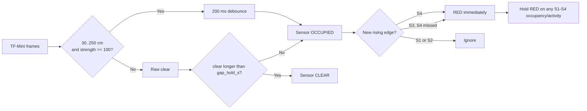
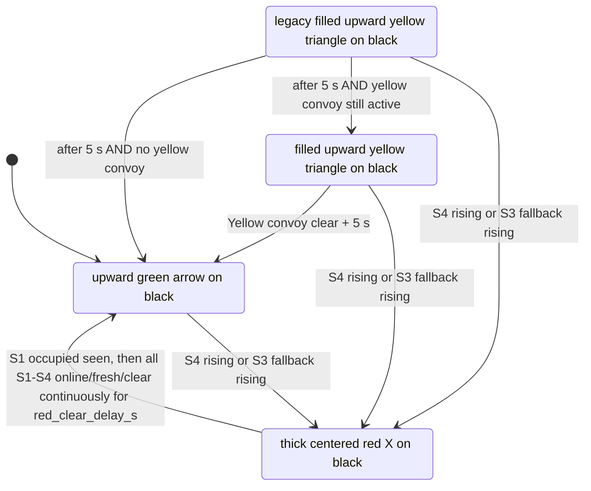

# Traffic Light Logic — Normal Junction V1

[Historical logic illustration](logic_diagram.png) — its display artwork is superseded by the symbol rules below.

## Purpose
This controller protects an E-Car junction using four downward TF-Mini Plus sensors. One E-Car may contain a cab/body, gaps, and multiple dollies, so a vehicle is **not** assumed to be one continuous solid object.

## Sensor positions and direction

```text
Junction                                                     STOP side
    <---- S1 ----1 m---- S2 ----------- S3 ----1 m---- S4 ---- travel
             RED entry                         RED fallback

Valid travel direction: S4 -> S3 -> S2 -> S1
RED trigger: S4 rising edge immediately
RED fallback: S3 rising edge when S4 missed
S2/S1 rising edges: no RED trigger
RED release: this RED cycle must first observe S1 occupied; then all S1-S4 must be online, fresh, and clear for red_clear_delay_s before direct GREEN/IDLE
Duplicate S4/S3 edges: suppressed until S1 is occupied
```

## Three-layer detection

1. **Raw frame** — valid TF-Mini frame, distance `30..250 cm`, strength `>= 100`.
2. **Sensor occupancy** — raw detect must pass 200 ms debounce. Short gaps up to `gap_hold_s` stay occupied, so cab/body/dolly gaps remain one convoy.
3. **RED entry edge** — a new S4 rising edge triggers RED immediately; a new S3 rising edge is the fallback when S4 missed. S2 and S1 are not RED entry sensors. Further S4/S3 edges are suppressed until the current RED cycle has observed S1 occupied, while every S1-S4 edge remains corridor activity during RED.



## Main state machine



`red_duration_s` remains in config as a legacy/reference value. RED exit is controlled by a per-cycle S1-occupied arm plus the corridor state. With `red_exit_sensor_fresh_timeout_s=0.5`, S1 must first be observed occupied during the current RED cycle; then every S1-S4 sensor must be online with a valid frame aged 0–0.5 s, all sensors must be clear, and that condition must remain continuous for the configured `red_clear_delay_s=1.0`. Before the S1 arm, or when any corridor sensor is occupied, active, offline, stale, missing, invalid, or future-dated, RED is held. Once the safe clear delay completes, production transitions directly to GREEN/IDLE; it does not enter RETURN YELLOW. An S4/S3 edge while RED is activity in the same RED cycle, not a state restart; the edge also prevents corridor-clear release. The legacy RETURN state remains available for compatibility and preempts to RED on a new S4/S3 edge if entered by another caller.

Known residual risk: a service restart while a vehicle is already in the corridor may not reconstruct RED without a new S4/S3 rising edge. This behavior is unchanged.

## E-Car + dolly waveform

```text
One convoy passing one sensor:

Cab        operator gap      rear body      hitch    dolly #1   hitch   dolly #2
█████████ _____ ███████████ ______ █████████ _____ ███████ _____ ███████
 detect    gap      detect           detect          detect       detect

Short gaps are absorbed by gap_hold_s, therefore this is treated as ONE convoy.
```

## Two E-Cars following each other

- If the inter-vehicle clear gap is shorter than `gap_hold_s`, they are intentionally treated as one convoy. This is safe for traffic-light operation.
- If the clear gap exceeds `gap_hold_s`, the sensor may produce a new rising edge; while RED, that edge is corridor activity and prevents release but does not create a second RED state cycle.
- The system is not intended to count vehicles precisely; it is intended to keep the junction indication safe and stable.

## Fault behavior

A sensor with no valid frame for `offline_timeout_s=2.0` is marked offline. The Pi continues its traffic logic and publishes fault details such as `ERR:S2`. Recovery requires valid frames continuously for `recover_stable_s=1.0`.

The symbol display retains explicit RED/STOP during faults; other faulted states render a yellow triangle. MQTT disconnection or no command for more than 5 seconds produces effective `LINK ERR`. Symbol mode does not draw fault text; maintenance uses diagnostics.


## Final HUB75 display behavior

Current field displays are D1–D3; software retains support for IDs 1–7. The Pi alone detects pairs and controls traffic timing. Healthy connected displays render the same MQTT state.

| State | Symbol | Background |
|---|---|---|
| IDLE | Upward green arrow | Black |
| YELLOW | Filled upward yellow triangle | Black |
| RED | Thick centered red X | Black |
| RETURN | Filled upward yellow triangle | Black |

Selection precedence: explicit `red` color or `STOP` text → red X; explicit `yellow` or `CAUTION` → yellow triangle; effective fault / `LINK ERR` → yellow triangle; explicit `green` or `GO` → green arrow; otherwise → yellow triangle. Missing or incorrectly typed text/color fields default to empty, never green.

Canonical project: `C:\TPCAP_TRAFFIC_LIGHT\AutoEcar_git\esp32_display`. Production environments are `display1_symbols`, `display2_symbols`, and `display3_symbols`; bench mode is disabled.
